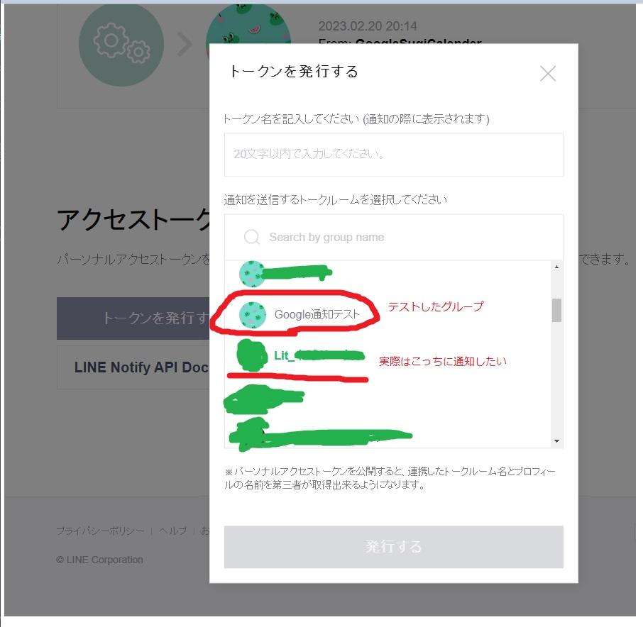

# lit-googleCalenderToLine
LitチームのためのGoogleカレンダーの情報をLineに送るために作ったBotのベース

## 概要
Googleカレンダーの情報をチームのグループにLine Botとして通知したいとのこと。

話としては大会などの締め切りがあるものに対して通知したいと聞いたので、それに絞って対応してみた

## 仕様
* Googleカレンダーの情報を5分とか10分ずつとか定期的に取得して〆切が近いか確認する
* カレンダーの情報が〆切ばかりとは限らないので「〆切」「締め切り」「締切」が含まれている予定を取得してまとめる（取得は当日分のみ）
* ベースのソースでは締切の10分前になったら通知するようにしておく
* GASで作る。定期的な取得はトリガーを使う
Y
## 取り扱い説明書

### 1.GoogleカレンダーIDを取得する
Googleカレンダー【設定】 → 【マイカレンダーの設定】 → 【カレンダーの統合】

IDはどっかに取っておいてください。

### 2.Line Notifyでアクセストークンを取得する
[Line Notify](https://notify-bot.line.me/ja/) でアクセストークンを取得してください。

Token名とどのグループ（個人）に送るか決めます。

発行したTokenはどっかに取っておいてください。

### 3.設定したグループ（個人）に「LINE Notify」を追加する。
グループ招待するところ、LINE Notifyと検索すれば追加できます。

これを追加しておかないと通知しません。

### 4.GASを書いていく
GASを書いていきます。内容は「仕様」で記載した通りです。

設定したgsファイルは[GoogleCalenderNoticeBts.gs](GoogleCalenderNoticeBts.gs)として保存してます。

こちらのソースを`スプレットシート` を作成して

しましょう。

AppScriptに適当な名前をつけて、gsファイルの中身をペーストしましょう。

あとは適当に編集してください。

### 5.トリガーを設定する
決められた時間に指定した関数を動かすみたいなやつです。
テスト上では時間をトリガーにし、何分毎に関数を叩くか設定します。

トリガー画面に遷移

トリガーを作成

トリガー設定

テストでは5分ごとにしてますが、gasコードで10分ごとにしてたんで通知が2回来てしまいましたが、そこらへんは適宜調整してください。

### 6.完成
こんな感じで通知がきます

